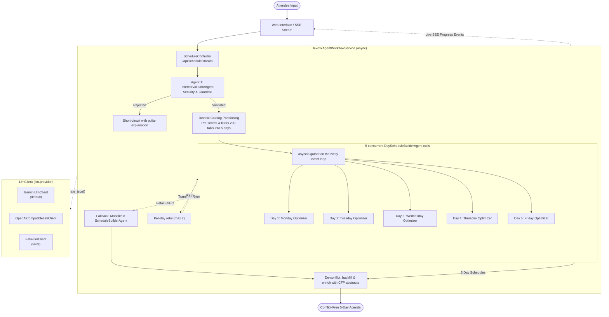

# Devoxx Belgium 2026 AI Schedule Curator (`dvxaisched`)

A Python application built with [Pyronaut](https://pyronaut.io), which runs Python on Micronaut and GraalPy. It uses an agentic LLM pipeline, by default backed by Google's **Gemini 3.5 Flash-Lite** (`gemini-3.5-flash-lite`), to generate personalized, conflict-free 5-day schedules for [Devoxx Belgium 2026](https://devoxx.be) (October 5–9, 2026, Kinepolis Antwerp).

The LLM backend sits behind a small `LlmClient` abstraction. You can swap Gemini for any OpenAI-compatible API (OpenAI, Ollama, vLLM and others) through configuration, and the test suite runs against a deterministic fake backend, so no API key is needed.

---

## Architecture & Agent Structure

The application is a resilient, multi-stage agentic pipeline written with Python `async`/`await`. Pyronaut runs coroutines on Micronaut's Netty event loop, so the five day planners run concurrently with `asyncio.gather`, without blocking threads.



### 1. Agent 1: Guardrail & Validator (`InterestValidatorAgent`)
- **Role:** Security and relevance guardrail.
- **Safety checks:**
  - Evaluates user input against **prompt injection** and jailbreaks (`DAN`, instruction overrides, system prompt exfiltration).
  - Flags insults, profanity, harassment, or completely meaningless gibberish.
  - Verifies relevance to software engineering, cloud, architecture, developer culture, and technology.
- **Outcome:** Produces a structured `ValidationResult`. A rejection short-circuits the pipeline with a friendly explanation, which saves tokens and time. If the validator itself fails, the request is rejected (fail-closed).

### 2. Fast Catalog Partitioning & Pre-Indexing
- Before any LLM call, the service scores the 200 official Devoxx Belgium sessions against the attendee's validated interests and keeps the best candidates.
- Sessions are partitioned across the 5 conference days according to Devoxx formatting rules: Deep Dives and Labs on Mon/Tue; Keynotes, Lunch talks and Conference sessions on Wed/Thu/Fri.

### 3. Agent 2: Parallel Day Optimizers (`DayScheduleBuilderAgent`)
- **Role:** Builds conflict-free daily agendas concurrently.
- **Concurrency:** Five `async` agent calls are awaited together with `asyncio.gather`. Each call awaits Micronaut's non-blocking HTTP client, so all five model requests are in flight at once on the Netty event loop.
- Each worker curates one conference day:
  - Selects 3 to 6 top sessions matching attendee interests.
  - Never picks overlapping time slots.
  - Writes a personalized rationale for each session.

### 4. Resilient Error Handling
- **Granular retries:** If one day worker fails (for example, a transient rate limit), only that day is retried, up to 2 times. The other days are kept, and each retry is reported to the live UI.
- **Post-processing:** Any overlaps the model produced are removed, sparse days are backfilled from the catalog, and abstracts and URLs are always taken from the official dataset.

### 5. Multi-Tier Fallback Safety Net
- **Tier 1:** The monolithic `ScheduleBuilderAgent` builds the whole week in a single call if the parallel stage fails.
- **Tier 2:** A deterministic catalog schedule is returned if the LLM is completely unreachable.

### 6. Live Observability & Streaming SSE
- `/api/schedule/stream` returns a Reactor `Flux` of Server-Sent Events. The workflow runs as an asyncio task on the request's event loop and pushes progress events into a Reactor sink as each stage and each day completes. These events drive the animated status cards in the web frontend.

### 7. Interactive Slot Re-Curator (`TalkAlternativeAgent`)
- **Role:** Lets attendees swap a talk they've already seen, or whose topic they know too well, for a compelling alternative.
- **Workflow:**
  - Finds parallel sessions in other rooms for that exact time slot.
  - The LLM evaluates the attendee's interests and picks the **top 3 alternatives** with personalized rationales. The call is bounded by a 6-second `asyncio.wait_for` timeout, and a deterministic ranking takes over if it fails.
  - The attendee picks a talk in a modal dialog. It replaces the original in place, and the ICS calendar and Markdown exports update automatically.

---

## Swappable LLM Backends

Agents never talk to a vendor SDK directly. Each agent builds an `LlmRequest` (task name, system prompt, user prompt and a JSON schema for the structured answer) and awaits `LlmClient.generate_json()`. The implementation is a Micronaut bean selected by `llm.provider`:

| `llm.provider` | Bean | Notes |
| --- | --- | --- |
| `gemini` (default) | `GeminiLlmClient` | Generative Language REST API `models/{model}:generateContent` with `responseJsonSchema` structured output. |
| `openai` | `OpenAiCompatibleLlmClient` | Any `POST {base}/chat/completions` server that supports `response_format: json_schema`: OpenAI, Ollama, vLLM, LM Studio and others. |
| `fake` | `FakeLlmClient` (tests only) | Deterministic answers derived from the prompt, with configurable failures and latency. |

Settings are bound with `@ConfigurationProperties` and can be set in `config/application.toml` or through environment variables:

```toml
[llm]
provider = "gemini"                 # LLM_PROVIDER

[llm.gemini]
api-key = "${GEMINI_API_KEY:}"
model = "gemini-3.5-flash-lite"     # LLM_GEMINI_MODEL
base-url = "https://generativelanguage.googleapis.com"
temperature = 0.2

[llm.openai]
api-key = "${OPENAI_API_KEY:}"
model = "..."                       # LLM_OPENAI_MODEL (required for this provider)
base-url = "${OPENAI_BASE_URL:https://api.openai.com/v1}"
```

For example, to run against a local Ollama model:

```bash
LLM_PROVIDER=openai OPENAI_BASE_URL=http://localhost:11434/v1 LLM_OPENAI_MODEL=qwen3 pyronaut dev
```

To add another provider, implement `LlmClient` in a new module and annotate it with `@Singleton` and `@Requires(property="llm.provider", value="<name>")`.

---

## Tech Stack

- **Runtime & Language:** Python 3.13 on GraalPy, hosted on a GraalVM JDK 25
- **Framework:** [Pyronaut](https://pyronaut.io) 0.0.10 / Micronaut 5.2 (Netty HTTP server and client, Serialization, Project Reactor, asyncio bridge)
- **LLM:** Google Gemini 3.5 Flash-Lite (`gemini-3.5-flash-lite`) by default, swappable via `LlmClient`
- **Testing:** pytest through `pyronaut test` with `MicronautTest` fixtures and `requests.with_context`
- **Cloud Infrastructure:** Google Cloud Run & Google Secret Manager
- **Automation:** `pyronaut` CLI + `just` task runner

---

## Prerequisites

- **Pyronaut CLI** (Python 3.10+ to install): `python3 -m pip install --upgrade pyronaut`, then `pyronaut setup`. Setup provisions the GraalVM JDK and GraalPy.
- **Gemini API Key:** from [Google AI Studio](https://aistudio.google.com/). Only needed to run the app with the default backend; tests don't need it.
- **`just`** (optional, recommended for quick commands): `brew install just`
- **`uv`** (optional, used by `just fetch`): `brew install uv`
- **Google Cloud SDK (`gcloud`)** (for deployment): `brew install --cask google-cloud-sdk`

---

## Local Development & Running

Set your Gemini API key:

```bash
export GEMINI_API_KEY="your-gemini-api-key"
```

### Using `just` (Recommended)

```bash
# Run the application locally with live reload (port 8080)
just dev

# Run all unit and integration test suites
just test

# Package the runnable fat JAR
just build

# Fetch the latest Devoxx BE 2026 schedule from CFP API
just fetch

# See all available commands
just
```

### Using `pyronaut`

```bash
pyronaut install   # resolve dependencies, create the GraalPy .venv, generate IDE stubs
pyronaut dev       # run with live reload
pyronaut test      # run the pytest suite
pyronaut build --jar && java -jar dist/dvxaisched-0.1.0.jar
```

Once started, open your browser:
- **Interactive Web UI:** [http://localhost:8080/](http://localhost:8080/)
- **Health Check:** [http://localhost:8080/api/health](http://localhost:8080/api/health)
- **Official Tracks:** [http://localhost:8080/api/tracks](http://localhost:8080/api/tracks)

---

## Testing

`pyronaut test` runs the pytest suite in `tests/` inside the application's runtime. `tests-config/application-test.toml` selects `llm.provider = "fake"`, so:

- The full pipeline (guardrail, five concurrent day planners, de-confliction, fallbacks, SSE streaming, alternatives, caching and rate limiting) is exercised deterministically, offline and without an API key.
- Failure modes are injected with `fake-llm.*` properties per test module, for example `fake-llm.fail-tasks = "plan-day"` or `fake-llm.fail-first-attempts = 1`.
- The real `GeminiLlmClient` and `OpenAiCompatibleLlmClient` are tested over HTTP against mock Gemini / Chat Completions endpoints served by the application under test (`tests/mock_llm_api.py`).

---

## Fetching Latest Conference Schedules

The application embeds the official Devoxx Belgium 2026 dataset in [`assets/devoxx-be-2026.json`](assets/devoxx-be-2026.json).

[`scripts/fetch_schedule.py`](scripts/fetch_schedule.py) queries the public Devoxx CFP REST API (`https://dvbe26.cfp.dev/api/public`), normalizes timezones (`Europe/Brussels`), merges speaker bios and full abstracts, sorts talks chronologically, and updates the dataset:

```bash
# Via just
just fetch

# Directly
uv run --no-project --script scripts/fetch_schedule.py

# Or fetch for a specific event slug (e.g. dvbe25)
just fetch dvbe25
```

---

## Deployment to Google Cloud Run

`just deploy` builds the fat JAR and deploys it from source. Cloud Build packages the JAR with the [`Dockerfile`](Dockerfile), which runs it on a GraalVM JDK 25 image so the embedded GraalPy runtime is JIT-compiled.

### Deploying via `just`

```bash
# Deploy to Google Cloud Run (pass project and region, or configure via env vars)
just project=YOUR_PROJECT_ID region=YOUR_REGION deploy

# Check deployed service status and URL
just project=YOUR_PROJECT_ID region=YOUR_REGION status

# View live Cloud Run logs
just project=YOUR_PROJECT_ID region=YOUR_REGION logs
```

### Manual Deployment via `gcloud`

```bash
# 1. Package the fat JAR
pyronaut build --jar

# 2. Deploy to Cloud Run (builds the Dockerfile with Cloud Build)
gcloud run deploy dvxaisched \
    --source=. \
    --region=YOUR_REGION \
    --project=YOUR_PROJECT_ID \
    --set-secrets=GEMINI_API_KEY=YOUR_SECRET_NAME:latest \
    --memory=2Gi \
    --cpu=2 \
    --allow-unauthenticated \
    --quiet
```

Alternatively, `pyronaut build --jvm --docker` (`just docker`) builds a container image with Pyronaut's own packager.

---

## License

This project is licensed under the [Apache License, Version 2.0](LICENSE).

---

## Disclaimer

This is not an official Google project. It is not an officially supported Google product.
