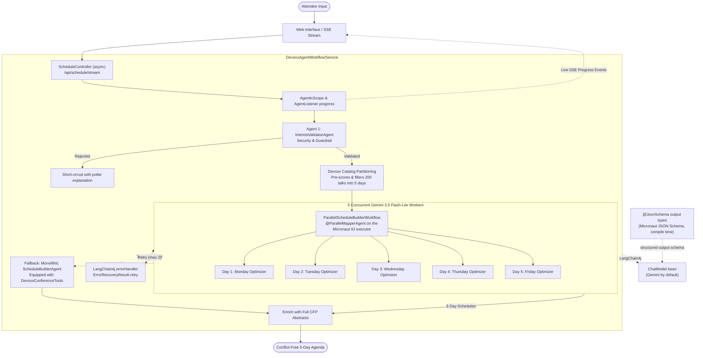

# Devoxx Belgium 2026 AI Schedule Curator (`dvxaisched`)

A Python application built with [Pyronaut](https://pyronaut.io), which runs Python on Micronaut and GraalPy. It uses the **LangChain4j Agentic Framework** through [Micronaut LangChain4j](https://micronaut-projects.github.io/micronaut-langchain4j/latest/guide/) and Google's **Gemini 3.5 Flash-Lite** (`gemini-3.5-flash-lite`) to generate personalized, conflict-free 5-day schedules for [Devoxx Belgium 2026](https://devoxx.be) (October 5–9, 2026, Kinepolis Antwerp).

This is a Python port of the original Java 25 application. The agents are the same LangChain4j AI services and agentic workflows, declared as Python abstract classes. The structured-output JSON schemas are generated at compile time by [Micronaut JSON Schema](https://micronaut-projects.github.io/micronaut-json-schema/latest/guide/). Gemini is just the configured `ChatModel`, so it can be swapped for any other LangChain4j provider, and the test suite runs against a deterministic fake `ChatModel` with no API key.

---

## Architecture & Agent Structure

The application is a resilient, multi-stage agentic pipeline built with LangChain4j (`langchain4j-agentic`) via Micronaut LangChain4j (`@AgenticService`, `@AiService`).



### 1. Agent 1: Guardrail & Validator (`InterestValidatorAgent`)
- **Role:** Security and relevance guardrail.
- **Safety checks:**
  - Evaluates user input against **prompt injection** and jailbreaks (`DAN`, instruction overrides, system prompt exfiltration).
  - Flags insults, profanity, harassment, or completely meaningless gibberish.
  - Verifies relevance to software engineering, cloud, architecture, developer culture, and technology.
- **Outcome:** Produces a structured `ValidationResult`. A rejection short-circuits the pipeline with a friendly explanation, which saves tokens and time. If the validator itself fails, the request is rejected (fail-closed).

### 2. Fast Catalog Partitioning & Pre-Indexing
- Before any LLM call, the service scores the 200 official Devoxx Belgium sessions against the attendee's validated interests and keeps the best candidates.
- Sessions are partitioned across the 5 conference days according to Devoxx formatting rules: Deep Dives and Labs on Mon/Tue; Keynotes, Lunch talks and Conference sessions on Wed/Thu/Fri.

### 3. Agent 2: Parallel Day Mapper (`ParallelScheduleBuilderWorkflow`)
- **Role:** Builds conflict-free daily agendas concurrently.
- **Parallel mapper:** A declarative LangChain4j `@ParallelMapperAgent` maps `DayScheduleBuilderAgent` over the five day requests. Its builder is customised with a Micronaut `BeanCreatedEventListener` to run on Micronaut's IO executor (platform threads, since GraalPy cannot run Python on virtual threads).
- The HTTP layer is `async`: each blocking agent invocation is handed to Micronaut's blocking executor with `run_in_executor`, keeping the Netty event loop free.
- **Sub-agent (`DayScheduleBuilderAgent`):** 5 concurrent Gemini 3.5 Flash-Lite workers each curate a single conference day:
  - Selects 3 to 6 top sessions matching attendee interests.
  - Never picks overlapping time slots.
  - Writes a personalized rationale for each session.

### 4. Resilient Error Handling (`errorHandler`)
- Configured with LangChain4j's native **`errorHandler`** on the parallel mapper builder (see `agent_listeners.py`).
- **Granular retries:** If one day worker fails (for example, a transient rate limit), the handler returns **`ErrorRecoveryResult.retry()`** up to 2 times for that day. The other 4 completed days are kept.
- **Progress visibility:** Each retry is reported to the live UI.
- **Post-processing:** Any overlaps the model produced are removed, sparse days are backfilled from the catalog, and abstracts and URLs are always taken from the official dataset.

### 5. Multi-Tier Fallback Safety Net
- **Tier 1:** If parallel mapping fails, the monolithic `ScheduleBuilderAgent` runs. It is equipped with `DevoxxConferenceTools`: `@Tool` methods for session search, tracks, daily schedules and favourites.
- **Tier 2:** A deterministic catalog schedule is returned if the LLM is completely unreachable.

### 6. Live Observability & Streaming SSE
- Implements LangChain4j's `AgentListener` (`afterAgentInvocation`, `beforeAgentToolExecution`, `afterAgentToolExecution`) in Python and attaches it to every agent builder with a `BeanCreatedEventListener[AgentBuilder]`.
- Each request's id travels in the `AgenticScope`. Listener events, including those from the parallel workers' threads, are routed back to that request through an `asyncio.Queue`.
- `/api/schedule/stream` is an async generator route (`async def … -> AsyncIterator[Event[WorkflowProgressEvent]]`). Micronaut streams each yielded Server-Sent Event as the client requests it, and a client disconnect closes the generator, which cancels the running workflow. The events drive the animated status cards in the web frontend.

### 7. Structured Outputs with Micronaut JSON Schema
- The agents' output types (`ValidationResult`, `PlannedDay`, `PlannedSchedule`, `TalkAlternativesResult`, …) are `@JsonSchema` dataclasses. Micronaut JSON Schema generates their schemas at compile time, using the docstrings as property descriptions and marking non-nullable properties as required (`strictMode`).
- `SchemaAwareChatModel` decorates whichever `ChatModel` bean is configured. It sends those generated schemas as the structured-output response format, in place of the schema LangChain4j would derive by reflection.

### 8. Schedule Cache (Micronaut Cache)
- Synthesized schedules are cached with Micronaut Cache's `@Cacheable` (Caffeine) under the normalized interests, so case and whitespace variations of a query share one entry. Settings live under `micronaut.caches.schedules` (`expire-after-write`, `maximum-size`).
- Only valid schedules are cached. A rejected schedule leaves the cached method as an exception, and Micronaut Cache never caches failed invocations.

### 9. Interactive Slot Re-Curator (`TalkAlternativeAgent`)
- **Role:** Lets attendees swap a talk they've already seen, or whose topic they know too well, for a compelling alternative.
- **Workflow:**
  - Finds parallel sessions in other rooms for that exact time slot.
  - An `@AiService` evaluates the attendee's interests and picks the **top 3 alternatives** with personalized rationales. The call is bounded by a 6-second `asyncio.wait_for` timeout, and a deterministic ranking takes over if it fails.
  - The attendee picks a talk in a modal dialog. It replaces the original in place, and the ICS calendar and Markdown exports update automatically.

---

## Swappable Chat Model

The agents use whatever LangChain4j `ChatModel` bean the application defines. By default that is Gemini, provided by `micronaut-langchain4j-googleai-gemini` and configured in `config/application.toml`:

```toml
[langchain4j.google-ai-gemini]
enabled = true
api-key = "${GEMINI_API_KEY:}"
model-name = "gemini-3.5-flash-lite"   # LANGCHAIN4J_GOOGLE_AI_GEMINI_MODEL_NAME

[langchain4j.google-ai-gemini.chat-model]
temperature = 0.2
timeout = "120s"
```

To use another provider, add its Micronaut LangChain4j module to `pyproject.toml` and configure it. For example, for OpenAI or any OpenAI-compatible server such as Ollama:

```toml
# pyproject.toml, [tool.pyronaut.dependencies].runtime
"io.micronaut.langchain4j:micronaut-langchain4j-openai",
```

```toml
# config/application.toml
[langchain4j.google-ai-gemini]
enabled = false

[langchain4j.open-ai]
api-key = "${OPENAI_API_KEY}"
model-name = "..."
# base-url = "http://localhost:11434/v1"   # e.g. Ollama
```

No agent code changes. If several chat models are configured, pick one per agent with `langchain4j.agentic.agents.<agent-id>.chat-model`.

## Tech Stack

- **Runtime & Language:** Python 3.13 on GraalPy, hosted on a GraalVM JDK 25
- **Framework:** [Pyronaut](https://pyronaut.io) 0.0.10 / Micronaut 5.2 (Netty HTTP server, Serialization, asyncio bridge with async generator streaming)
- **Agentic AI:** LangChain4j 1.20 (`langchain4j-agentic`) via Micronaut LangChain4j 2.3
- **Structured outputs:** Micronaut JSON Schema 2.3 (compile-time `@JsonSchema`)
- **Caching:** Micronaut Cache with Caffeine (`@Cacheable`)
- **LLM:** Google Gemini 3.5 Flash-Lite (`gemini-3.5-flash-lite`), swappable for any LangChain4j provider
- **Testing:** pytest through `pyronaut test` with `MicronautTest` fixtures and `requests.with_context`
- **Cloud Infrastructure:** Google Cloud Run & Google Secret Manager
- **Automation:** `pyronaut` CLI + `just` task runner

---

## Prerequisites

- **Pyronaut CLI** (Python 3.10+ to install): `python3 -m pip install --upgrade pyronaut`, then `pyronaut setup`. Setup provisions the GraalVM JDK and GraalPy.
- **Gemini API Key:** from [Google AI Studio](https://aistudio.google.com/). Only needed to run the app with the default backend; tests don't need it.
- **`just`** (optional, recommended for quick commands): `brew install just`
- **`uv`** (optional, used by `just fetch`): `brew install uv`
- **Google Cloud SDK (`gcloud`)** (for deployment): `brew install --cask google-cloud-sdk`

---

## Local Development & Running

Set your Gemini API key:

```bash
export GEMINI_API_KEY="your-gemini-api-key"
```

### Using `just` (Recommended)

```bash
# Run the application locally with live reload (port 8080)
just dev

# Run all unit and integration test suites
just test

# Package the runnable fat JAR
just build

# Fetch the latest Devoxx BE 2026 schedule from CFP API
just fetch

# See all available commands
just
```

### Using `pyronaut`

```bash
pyronaut install   # resolve dependencies, create the GraalPy .venv, generate IDE stubs
pyronaut dev       # run with live reload
pyronaut test      # run the pytest suite
pyronaut build --jar && java -jar dist/dvxaisched-0.1.0.jar
```

Once started, open your browser:
- **Interactive Web UI:** [http://localhost:8080/](http://localhost:8080/)
- **Health Check:** [http://localhost:8080/api/health](http://localhost:8080/api/health)
- **Official Tracks:** [http://localhost:8080/api/tracks](http://localhost:8080/api/tracks)

---

## Testing

`pyronaut test` runs the pytest suite in `tests/` inside the application's runtime. `tests-config/application-test.toml` disables Gemini, so `tests/fake_chat_model.py` provides the `ChatModel` bean:

- The real agents, prompts, structured outputs, tool calling, the parallel mapper, retries, fallbacks, SSE streaming, alternatives, caching and rate limiting are all exercised deterministically, offline and without an API key.
- The fake records the JSON schema of every request, so the tests also assert that the compile-time Micronaut JSON Schema is the one sent to the model.
- Failure modes and latency are injected per test module with `fake-llm.*` properties (bound to a `@ConfigurationProperties` class), for example `fake-llm.fail-tasks = "plan-day"` or `fake-llm.fail-first-attempts = 1`.
- `test_gemini_chat_model.py` exercises the real Micronaut LangChain4j Gemini `ChatModel` over HTTP against a mock Gemini API served by the application under test (`tests/mock_gemini_routes.py`).

## Fetching Latest Conference Schedules

The application embeds the official Devoxx Belgium 2026 dataset in [`assets/devoxx-be-2026.json`](assets/devoxx-be-2026.json).

[`scripts/fetch_schedule.py`](scripts/fetch_schedule.py) queries the public Devoxx CFP REST API (`https://dvbe26.cfp.dev/api/public`), normalizes timezones (`Europe/Brussels`), merges speaker bios and full abstracts, sorts talks chronologically, and updates the dataset:

```bash
# Via just
just fetch

# Directly
uv run --no-project --script scripts/fetch_schedule.py

# Or fetch for a specific event slug (e.g. dvbe25)
just fetch dvbe25
```

---

## Deployment to Google Cloud Run

`just deploy` builds the fat JAR and deploys it from source. Cloud Build packages the JAR with the [`Dockerfile`](Dockerfile), which runs it on the Oracle GraalVM `25i4` JDK image (`container-registry.oracle.com/graalvm/jdk:25i4`, GraalVM 25.0.4.1.1). That matches the polyglot version of the embedded GraalPy runtime, so Python code is JIT-compiled.

### Deploying via `just`

```bash
# Deploy to Google Cloud Run (pass project and region, or configure via env vars)
just project=YOUR_PROJECT_ID region=YOUR_REGION deploy

# Check deployed service status and URL
just project=YOUR_PROJECT_ID region=YOUR_REGION status

# View live Cloud Run logs
just project=YOUR_PROJECT_ID region=YOUR_REGION logs
```

### Manual Deployment via `gcloud`

```bash
# 1. Package the fat JAR
pyronaut build --jar

# 2. Deploy to Cloud Run (builds the Dockerfile with Cloud Build)
gcloud run deploy dvxaisched \
    --source=. \
    --region=YOUR_REGION \
    --project=YOUR_PROJECT_ID \
    --set-secrets=GEMINI_API_KEY=YOUR_SECRET_NAME:latest \
    --memory=2Gi \
    --cpu=2 \
    --allow-unauthenticated \
    --quiet
```

Alternatively, `pyronaut build --jvm --docker` (`just docker`) builds a container image with Pyronaut's own packager.

---

## License

This project is licensed under the [Apache License, Version 2.0](LICENSE).

---

## Disclaimer

This is not an official Google project. It is not an officially supported Google product.
